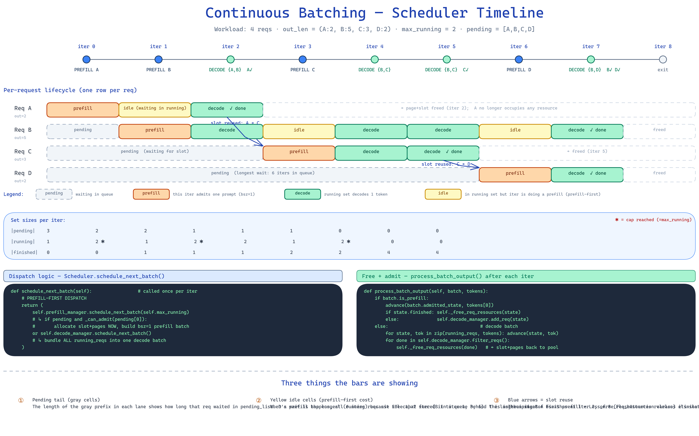

# Lesson 7 Technical：Continuous Batching 代码走读

## 目录

- [1. 总体架构](#1-总体架构)
- [2. 共用类型：`common.py`](#2-共用类型commonpy)
- [3. `PrefillManager`](#3-prefillmanager)
- [4. `DecodeManager`](#4-decodemanager)
- [5. `Scheduler`（顶层编排）](#5-scheduler顶层编排)
- [6. `LLM.generate`](#6-llmgenerate)
- [7. 小改动：`Req.generated`](#7-小改动reqgenerated)
- [8. 端到端执行流](#8-端到端执行流)
- [9. 与 mini-sglang 的对齐与简化](#9-与-mini-sglang-的对齐与简化)

---

## 1. 总体架构

```
scheduler/
├── common.py       # ScheduledBatch / _ReqState / _PendingReq
├── prefill.py      # PrefillManager（pending 队列 + bsz=1 admission）
├── decode.py       # DecodeManager（running 集合 + 每步全批 decode）
├── scheduler.py    # Scheduler（编排 prefill_manager | decode_manager + 释放）
├── cache.py        # CacheManager（未改动）
└── table.py        # TableManager（未改动）
```

`llm.py` 的 `LLM.generate` 直接走连续批处理路径；`bench.py` 也只暴露
`--max-running-reqs` 这一个调度旋钮。

和 Lesson 6 static scheduler 的代码结构对比一目了然：


> 左：static 的 4 阶段（init_requests → iter_prefill_batches → schedule_decode_batch loop → finalize_results）
> 右：continuous 的 4 阶段（add_request → schedule_next_batch 单循环 → process_batch_output 立即 free → collect_results）
> 底部 6 行对照表归纳了 admission window / loop structure / resource lifetime 等核心差异。

---

## 2. 共用类型：`common.py`

```python
@dataclass
class _ReqState:
    req: Req
    sampler: Sampler
    finished: bool = False

@dataclass
class _PendingReq:
    input_ids: torch.Tensor
    sampling_params: SamplingParams
    uid: int

@dataclass
class ScheduledBatch:
    batch: Batch
    samplers: List[Sampler]
    state_indices: List[int]                  # 用于 decode 路径回写下标
    admitted_state: _ReqState | None = None   # PrefillManager 在 bsz=1 prefill 时带出
```

为什么需要 `admitted_state`？——prefill 是 **bsz=1 的新请求入场**。它的状态还没加进
`DecodeManager.running_reqs`；`process_batch_output` 需要拿到这个新建的 `_ReqState`
才能决定"加入 running 集合"还是"直接释放"。

---

## 3. `PrefillManager`

文件：`python/aios/scheduler/prefill.py`

核心职责：维护 `pending_list`，每步尝试 admit **队首**一个请求。

```python
@dataclass
class PrefillManager:
    cache_manager: CacheManager
    table_manager: TableManager
    decode_manager: DecodeManager  # 回看 inflight_tokens
    device: torch.device
    pending_list: List[_PendingReq] = field(default_factory=list)

    def add_one_req(self, pending: _PendingReq) -> None:
        self.pending_list.append(pending)

    @property
    def runnable(self) -> bool:
        return bool(self.pending_list)

    def _can_admit(self, pending, max_running) -> bool:
        if self.table_manager.available_size == 0:
            return False
        if len(self.decode_manager.running_reqs) >= max_running:
            return False
        needed = len(pending.input_ids) + pending.sampling_params.max_tokens
        reserved = self.decode_manager.inflight_tokens   # mini-sglang 同名概念
        return (needed + reserved) <= len(self.cache_manager._free_slots)

    def schedule_next_batch(self, max_running) -> ScheduledBatch | None:
        if not self.pending_list: return None
        head = self.pending_list[0]
        if not self._can_admit(head, max_running): return None
        self.pending_list.pop(0)

        table_idx = self.table_manager.allocate()
        prompt_len = len(head.input_ids)
        pages = self.cache_manager.allocate(prompt_len)
        self.table_manager.page_table[table_idx, :prompt_len] = pages
        self.table_manager.token_pool[table_idx, :prompt_len] = head.input_ids.to(torch.int32)

        req = Req(input_ids=head.input_ids, cached_len=0,
                  output_len=head.sampling_params.max_tokens,
                  uid=head.uid, sampling_params=head.sampling_params,
                  table_idx=table_idx)
        state = _ReqState(req=req, sampler=Sampler(head.sampling_params))

        input_ids = head.input_ids.to(self.device).long().unsqueeze(0)
        positions = torch.arange(prompt_len, device=self.device).unsqueeze(0)
        out_loc   = self.table_manager.page_table[table_idx, :prompt_len].unsqueeze(0)
        batch = Batch(reqs=[req], phase="prefill",
                      input_ids=input_ids, positions=positions, out_loc=out_loc,
                      page_table=self.table_manager.page_table)
        return ScheduledBatch(batch=batch, samplers=[state.sampler],
                              state_indices=[0], admitted_state=state)
```

要点：

1. **admission 守卫 `_can_admit`**：同时检查"有没有 table slot"、"running 没超额"、
   "可用 page 数够不够放下这次 prefill + 未来的 decode + 已经 running 的尾部 decode"。
   `inflight_tokens` 是对在跑请求还要再生成多少 token 的保守上界，避免把页分光了让 running 请求
   走不下去。
2. **只 admit 一个**：bsz=1 让 `_batched_paged_attention` 的 prefill 分支继续工作（不需要
   varlen 支持）。
3. `schedule_next_batch` 负责真正的**资源分配**（table slot、prompt pages、写 token_pool），
   因为 admit 和 forward 之间没有其他可能失败的步骤。

---

## 4. `DecodeManager`

文件：`python/aios/scheduler/decode.py`

职责：维护 `running_reqs`，把它们打成一个 decode batch。

```python
@dataclass
class DecodeManager:
    cache_manager: CacheManager
    table_manager: TableManager
    device: torch.device
    running_reqs: List[_ReqState] = field(default_factory=list)

    def add_req(self, state): self.running_reqs.append(state)

    def filter_reqs(self) -> List[_ReqState]:
        finished = [s for s in self.running_reqs if s.finished]
        if finished:
            self.running_reqs = [s for s in self.running_reqs if not s.finished]
        return finished

    @property
    def inflight_tokens(self) -> int:
        return sum(s.req.remain_len for s in self.running_reqs)

    @property
    def runnable(self) -> bool:
        return bool(self.running_reqs)

    def schedule_next_batch(self) -> ScheduledBatch | None:
        if not self.running_reqs: return None
        reqs     = [s.req for s in self.running_reqs]
        samplers = [s.sampler for s in self.running_reqs]
        table_idxs = torch.tensor([r.table_idx for r in reqs], device=self.device, dtype=torch.long)
        pos_1d     = torch.tensor([r.cached_len for r in reqs], device=self.device, dtype=torch.long)
        new_pages  = self.cache_manager.allocate(len(reqs))
        self.table_manager.page_table[table_idxs, pos_1d] = new_pages
        input_ids = self.table_manager.token_pool[table_idxs, pos_1d].long().unsqueeze(1)
        batch = Batch(reqs=reqs, phase="decode",
                      input_ids=input_ids, positions=pos_1d.unsqueeze(1),
                      out_loc=new_pages.unsqueeze(1),
                      page_table=self.table_manager.page_table)
        return ScheduledBatch(batch=batch, samplers=samplers,
                              state_indices=list(range(len(reqs))), admitted_state=None)
```

保留 `List` 而不是 `Set`（mini-sglang 用 Set）——列表保持 admit 顺序，便于确定性复现和
bench 对比。

---

## 5. `Scheduler`（顶层编排）

文件：`python/aios/scheduler/scheduler.py`

```python
class Scheduler:
    def __init__(self, table_manager, cache_manager, eos_token_id, device, max_running_reqs):
        ...
        self.decode_manager  = DecodeManager(cache_manager, table_manager, device)
        self.prefill_manager = PrefillManager(cache_manager, table_manager, self.decode_manager, device)
        self.finished: List[_ReqState] = []
        self._next_uid = 0

    def add_request(self, input_ids, sp) -> int:
        uid = self._next_uid; self._next_uid += 1
        self.prefill_manager.add_one_req(_PendingReq(input_ids, sp, uid))
        return uid

    def schedule_next_batch(self) -> ScheduledBatch | None:
        return (self.prefill_manager.schedule_next_batch(self.max_running)
                or self.decode_manager.schedule_next_batch())

    def process_batch_output(self, scheduled, next_tokens):
        tokens = next_tokens.view(-1).tolist()
        if scheduled.batch.is_prefill:
            state = scheduled.admitted_state
            self._advance(state, tokens[0])
            if state.finished:
                self._free_req_resources(state); self.finished.append(state)
            else:
                self.decode_manager.add_req(state)
        else:
            for state, tok in zip(self.decode_manager.running_reqs, tokens):
                self._advance(state, tok)
            for state in self.decode_manager.filter_reqs():
                self._free_req_resources(state); self.finished.append(state)
```

关键点：

- `schedule_next_batch` 的 `prefill_or_decode` 策略与 mini-sglang 完全一致：
  **prefill-first**，只有当 pending 吃不下（或没 pending）时才跑 decode。
- `process_batch_output` 是**整条状态机的心脏**：
  - prefill 结果 → 新 req 生成了第 1 个 token，进入 running（或立即结束，视 EOS/max_tokens）。
  - decode 结果 → 每个 running 追加 1 个 token，`filter_reqs` 把完成者摘出来；
    `_free_req_resources` **立即**释放其 pages + slot——这是整节课的核心。
- `_advance` 做两件事：追加 token 到 token_pool（为下一步 decode 输入提供数据）、追加到
  `req.generated`（最终输出）。

---

## 6. `LLM.generate`

文件：`python/aios/llm/llm.py`

```python
def generate(self, prompts, sampling_params=None, max_running_reqs=None):
    params_list = ...  # 标准化
    all_input_ids = [tokenize(p) for p in prompts]
    max_running_reqs = max(1, min(max_running_reqs or len(prompts), len(prompts)))
    max_total_len = max(len(ids) + sp.max_tokens for ids, sp in zip(all_input_ids, params_list))
    page_table = torch.zeros((max_running_reqs, max_total_len), dtype=torch.int32, device=self.device)
    table_manager = TableManager(max_running_reqs, page_table)

    scheduler = Scheduler(table_manager, self.cache_manager,
                          self.tokenizer.eos_token_id, self.device,
                          max_running_reqs=max_running_reqs)
    engine = Engine(model=self.model, mha_kv_cache=self.mha_kv_cache)

    for ids, sp in zip(all_input_ids, params_list):
        scheduler.add_request(ids, sp)

    while scheduler.has_work:
        scheduled = scheduler.schedule_next_batch()
        if scheduled is None: break
        next_tokens = engine.run_batch(scheduled)
        scheduler.process_batch_output(scheduled, next_tokens)

    return scheduler.collect_results(self.tokenizer)
```

`page_table` 高度被压到 `max_running_reqs` 而不是请求总数——这是整套 "cap running set" 语义的
落地：内存占用不再与总请求数成正比。

---

## 7. 小改动：`Req.generated`

`python/aios/core.py`：

```python
@dataclass(eq=False)
class Req:
    ...
    generated: List[int] = field(default_factory=list)
```

由于**请求完成就立即释放**，`token_pool` 对应行可能已经被新请求覆盖。
解决方法：每次 `_advance` 追加 `tok` 到 `req.generated`——这是一个**纯 Python 列表**，
与 GPU 资源无关，能在释放之后幸存。

---

## 8. 端到端执行流

以 `num_seqs=4, max_running=2` 为例（输出长度：A=2, B=5, C=3, D=2，所有请求 prompt 同长）：



iter-by-iter 状态轨迹（与图中 Set sizes 行对应）：

```
iter  action                     pending      running       事件
─────────────────────────────────────────────────────────────────
 0    prefill A                  [B,C,D]      [A]           A 入 running
 1    prefill B                  [C,D]        [A,B]         cap=2 reached
 2    decode {A,B} → A✓          [C,D]        [B]           filter+free(A)
 3    prefill C                  [D]          [B,C]         slot 复用 A 的位置
 4    decode {B,C}               [D]          [B,C]         无完成
 5    decode {B,C} → C✓          [D]          [B]           filter+free(C)
 6    prefill D                  []           [B,D]         slot 复用 C 的位置
 7    decode {B,D} → B,D 都完结    []           []            filter+free(B,D)
 8    None (has_work=False) → 退出循环
```

读图三个要点：

① **pending 灰色段长度** = 该请求等待被 admit 的 iter 数。D 等了 6 iter，因为
   cap=2 始终被 B 占着（B 是最长请求）。
② **黄色 idle cell** = 该请求在 running 但本 iter 跑了 prefill（prefill-first
   的代价），自己没进 decode batch。Lesson 8 的 FlashAttention varlen 会消除这个 idle。
③ **蓝色弧线 = slot 复用**：A 在 iter 2 完成时 `_free_req_resources` 立即释放
   `table_idx`，C 在 iter 3 通过 `table.allocate()` 拿到同一个 row。

---

## 9. 与 mini-sglang 的对齐与简化

**命名 / 职责对齐**：

| mini-sglang | AIOS Lesson 7 |
|---|---|
| `scheduler/scheduler.py::Scheduler` | `scheduler/scheduler.py::Scheduler` |
| `scheduler/prefill.py::PrefillManager` | `scheduler/prefill.py::PrefillManager` |
| `scheduler/decode.py::DecodeManager` | `scheduler/decode.py::DecodeManager` |
| `PrefillManager.add_one_req` | 同名 |
| `PrefillManager.schedule_next_batch(budget)` | 同名（参数语义收窄为 `max_running`） |
| `DecodeManager.filter_reqs` / `inflight_tokens` / `runnable` | 同名 |
| `Scheduler._free_req_resources` | 同名 |
| `Scheduler._schedule_next_batch = prefill or decode` | 同名策略 |

**刻意差异**（教学简化 / 后续课程补齐）：

1. **`PrefillManager` 无 `PrefillAdder` / `ChunkedReq`**——bsz=1 让 budget 概念退化成
   "admit 一个就停"，不需要 adder 类；chunked prefill 超出本节范围。
2. **`running_reqs` 是 List 不是 Set**——便于确定性顺序。
3. **无 `cache_req` / prefix cache 插入**——Lesson 13 专题。
4. **无 `overlap_loop` / 第二条 CUDA stream**——高级优化。
5. **无 `receive_msg` / IPC**——Lesson 15（API Server）补。
6. **`max_extend_tokens` 变成 `max_running_reqs` cap**——更直观地展示"槽位反压"。

---

代码导航：

- `python/aios/scheduler/scheduler.py` — `Scheduler`
- `python/aios/scheduler/prefill.py` — `PrefillManager`
- `python/aios/scheduler/decode.py` — `DecodeManager`
- `python/aios/scheduler/common.py` — 共用类型
- `python/aios/llm/llm.py::LLM.generate` — 用户入口
- `benchmark/bench.py` — `--max-running-reqs N`
- `resources/lesson-7-continuous-batching/run_lesson7.py` — 演示脚本
